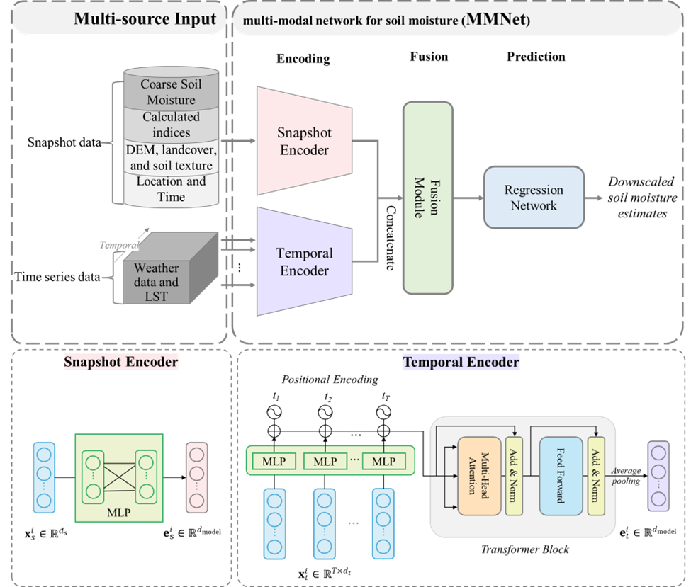

# MMNet
PyTorch implementation of "Integration of Snapshot and Time Series Data for Improving SMAP Soil Moisture Downscaling"

**Abstract**: Understanding soil moisture (SM) dynamics is crucial for environmental and agricultural applications. While satellite-based SM products provide extensive coverage, their coarse spatial resolution often fails to capture local SM variability. This study presents multi-modal network (MMNet) that integrates snapshot and time series data to downscale Soil Moisture Active Passive (SMAP) Level 4 surface SM. Specifically, the model takes multiple publicly available datasets as input: snapshot data includes optical imagery, Synthetic Aperture Radar (SAR) imagery, terrain attributes, landcover information, and soil properties, and time series data incorporates antecedent weather and land surface temperature (LST) collected over the preceding days. In-situ surface (0-5 cm) SM measurements from the Soil Climate Analysis Network (SCAN) and the United States Climate Reference Network (USCRN) were used as ground truth. We evaluated MMNet under three scenarios: on-site, off-site, and cross-region, and compared its performance with models that utilize either snapshot (Multilayer Perceptron – MLP) or time series (Transformer) data. The results showed that: 1) MMNet trained with on-site data provided accurate SM estimates over time in withheld years; 2) MMNet demonstrated spatial transferability, capturing SM dynamics in regions with sparse or no in-situ measurements; 3) the integration of snapshot and time series data was crucial for maintaining the model’s accuracy and generalizability across diverse scenarios. The downscaled SM maps demonstrated its potential for producing high-resolution temporally and spatially continuous SM estimates, which could further support a broad range of environmental and agricultural applications.



## Requirements

* Pytorch 3.8.12, PyTorch 1.11.0, and more in `environment.yml`

## Usage

Setup conda environment and activate

```bash
conda env create -f environment.yml
conda activate py38
```

### 1. Data Preparation

* **Download in-situ data**: Visit the [International Soil Moisture Network (ISMN)](https://ismn.bafg.de/en/dataviewer/) and download in-situ SM data for stations and years of your interest.
* **Download input dadasets**: Use the provided Google Earth Engine script `gee_download.js` to export datasets used in this study.
* **Preprocess input datasets**: Run the three scripts in the `preprocessing/` *in order* to organize the raw data into model-ready format:
```bash
python preprocessing/1. merge_multi_csv.py
python preprocessing/2. data_cleaning.py
python preprocessing/3. make_time_series.py
```

### 2. Model Training and Evaluation

* `exp-1`: cross year scenario - train on previous 3 years, test on 1 year (It will run iterate through test years from 2019 to 2022)

```bash
python train_supervised_ts.py --model mmnet -e 1
```

* `exp-1`: if you want to specify training years

```bash
python train_supervised_ts.py --model mmnet -e 1 --target 2019
```

* `exp-2`: 5-fold validation by stations - train on 80% of stations, test on 20%. Results are reported at station-level (mean/median)

```bash
python train_supervised_ts.py --model mmnet -e 2
```

* `exp-3`: cross-region scenario - stations are divided into regions (W, M, E), train on two regions, test on the other. Results are reported at station-level.

```bash
python train_supervised_ts.py --model mmnet -e 3
```

* save test prediction for result visualization

```bash
python train_supervised_ts.py --model mmnet -e 3 --save_pred
```

* `train_supervised_ts.py` supports models `transformer` and `mmnet`. For MLP results (default exp1, model-MLP):

```bash
python train_supervised.py
```

### Results Analysis (Optional)

See `results/` for optional post hoc interpretation.

[//]: # (## Reference)

[//]: # (In case you find MMNet or the code useful, please consider citing our paper using the following BibTex entry:)

[//]: # (```)

[//]: # ()
[//]: # (```)

## Credits
The in-situ data from SCAN and USCRN can be accessed from the [International Soil Moisture Network (ISMN)](https://ismn.bafg.de/en/dataviewer/). All used input datasets can be accessed through the [Google Earth Engine (GEE) platform]( https://developers.google.com/earth-engine/datasets/catalog): 
- **SMAP Level-4 (L4) Soil Moisture Product**: Available at [SPL4SMGP.007](https://developers.google.com/earth-engine/datasets/catalog/NASA_SMAP_SPL4SMGP_007).
- **Landsat-8 Data**: Accessible via [HLSL30](https://developers.google.com/earth-engine/datasets/catalog/NASA_HLS_HLSL30_v002) for potential integration with [HLSS30](https://developers.google.com/earth-engine/datasets/catalog/NASA_HLS_HLSS30_v002). 
- **Sentinel-1 Data**: Available at [Sentinel-1 SAR GRD](https://developers.google.com/earth-engine/datasets/catalog/COPERNICUS_S1_GRD). 
- **Weather Variables (gridMET)**: Can be accessed from [GRIDMET](https://developers.google.com/earth-engine/datasets/catalog/IDAHO_EPSCOR_GRIDMET). 
- **MODIS Land Surface Temperature (LST)**: Available at [MOD11A1.061](https://developers.google.com/earth-engine/datasets/catalog/MODIS_061_MOD11A1). 
- **Terrain Attributes**: Available at [The U.S. Geological Survey (USGS) 3D Elevation Program (3DEP) dataset](https://developers.google.com/earth-engine/datasets/catalog/USGS_3DEP_10m).
- **Land Cover Data**: The National Land Cover Dataset (NLCD) products can be downloaded from the [USGS website](https://www.sciencebase.gov/catalog/item/6345b637d34e342aee0863aa) and accessed on the GEE platform via [NLCD 2019](https://developers.google.com/earth-engine/datasets/catalog/USGS_NLCD_RELEASES_2019_REL_NLCD) and [NLCD 2021](https://developers.google.com/earth-engine/datasets/catalog/USGS_NLCD_RELEASES_2021_REL_NLCD). 
- **Soil Properties **: Available from the [SOLARIS](http://hydrology.cee.duke.edu/POLARIS/) for direct download, and also accessible via the GEE platform following [this link](https://gee-community-catalog.org/projects/polaris/#notes-from-data-providers).